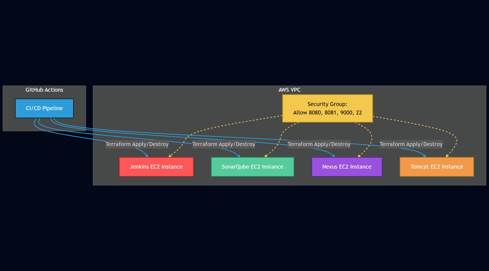

---

# AWS DevOps Infra Automation with Terraform & GitHub Actions

This repository provisions four AWS EC2 instances—**Jenkins, SonarQube, Nexus, Tomcat**—using reusable Terraform modules, user data scripts, and GitHub Actions CI/CD.
**State management is handled securely with an S3 bucket and DynamoDB table for state locking.**

---

## 📦 Structure

```text
infra-aws/
├── modules/
│   └── ec2/         # Reusable EC2 Terraform module
├── env/
│   ├── main.tf      # Environment configuration (root module)
│   └── backend.tf   # S3/DynamoDB remote state backend config
├── scripts/         # User data scripts for each server
└── .github/
    └── workflows/   # GitHub Actions workflows for apply/destroy
```

---

## 🚀 Getting Started

1. **Clone the repo** `https://github.com/m-pasima/terraform-aws-devops-lab.git`
2. Update variables as needed (e.g., `ami` for your region).
3. **Provision Remote State Infrastructure**

   * Make sure you have an S3 bucket (e.g., `demo-basics`) and a DynamoDB table (`terraform-locks`) in your AWS account.
   * See below for [Terraform Remote State Setup](#-terraform-remote-state).
4. **Store AWS credentials** in GitHub Secrets:

   * `AWS_ACCESS_KEY_ID`
   * `AWS_SECRET_ACCESS_KEY`
5. Push changes to your main branch.
6. GitHub Actions will run `terraform apply` automatically.
   Trigger `terraform destroy` manually via the Actions tab.

---

## 🗃️ Terraform Remote State

> **This project uses remote state for team safety and reliability!**

* State is stored in an S3 bucket (`demo-basics`) for reliability and team access.
* State locking uses DynamoDB table (`terraform-locks`) to prevent accidental overwrites.
* You do **not** need to upload or download `.tfstate` files—Terraform manages this remotely.

**Example backend block (`infra-aws/env/backend.tf`):**

```hcl
terraform {
  backend "s3" {
    bucket         = "demo-basics"
    key            = "dev/terraform.tfstate"
    region         = "eu-west-2"
    dynamodb_table = "terraform-locks"
    encrypt        = true
  }
}
```

---

## 🛠️ Components

* **EC2 Instances:** Jenkins, SonarQube, Nexus, Tomcat
* **Terraform:** Reusable EC2 module for all servers
* **GitHub Actions:** Automated CI/CD for apply/destroy
* **User Data Scripts:** Installs and configures each app on instance boot

---

## 🔒 Security Group

**Ports open:**

* **8080** (Jenkins, Tomcat)
* **9000** (SonarQube)
* **8081** (Nexus)
* **22** (SSH)

---

## ⚡ Workflows

* **Apply Workflow:** Auto-runs on `main` branch push.
* **Destroy Workflow:** Trigger manually via Actions tab.

Both workflows use official GitHub Actions for Terraform and AWS authentication.
No state files are checked in or uploaded as artifacts—S3 backend manages all state.

---

## 🖼️ Architecture Diagram



---

## 🧑‍💻 Author

DevOps automation by **Passy (Pasima)** — [Contact](https://www.linkedin.com/in/your-link-here)

---

**Questions, PRs, or issues? Feel free to reach out or open an issue!**

---


